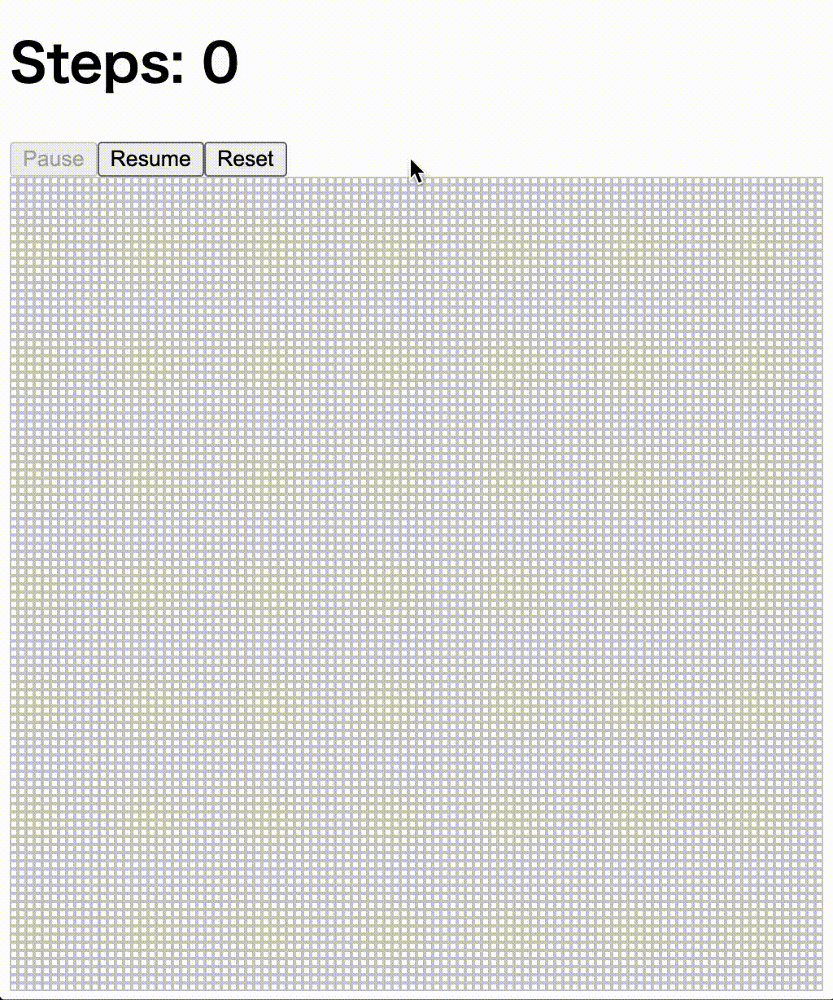

# Langton's Ant

This project was proudly generated by ChatGPT, demonstrating its ability to
produce functional and well-structured Elm code.

## Overview

Langton's Ant is a simple, yet fascinating cellular automaton model that exhibits 
emergent behavior. In this project, we have implemented an interactive simulation 
of Langton's Ant in Elm, allowing users to observe and explore the dynamic 
patterns formed by the ant as it traverses the grid according to a set of basic 
rules.



## Usage

In the project directory, you can run the following commands to compile the 
project and open it in a web browser:

```bash
elm make src/Main.elm --output=main.js
open index.html
```

## References

Langton, C. G. (1986). Studying Artificial Life with Cellular Automata. 
Physica D: Nonlinear Phenomena, 22(1-3), 120-149.
